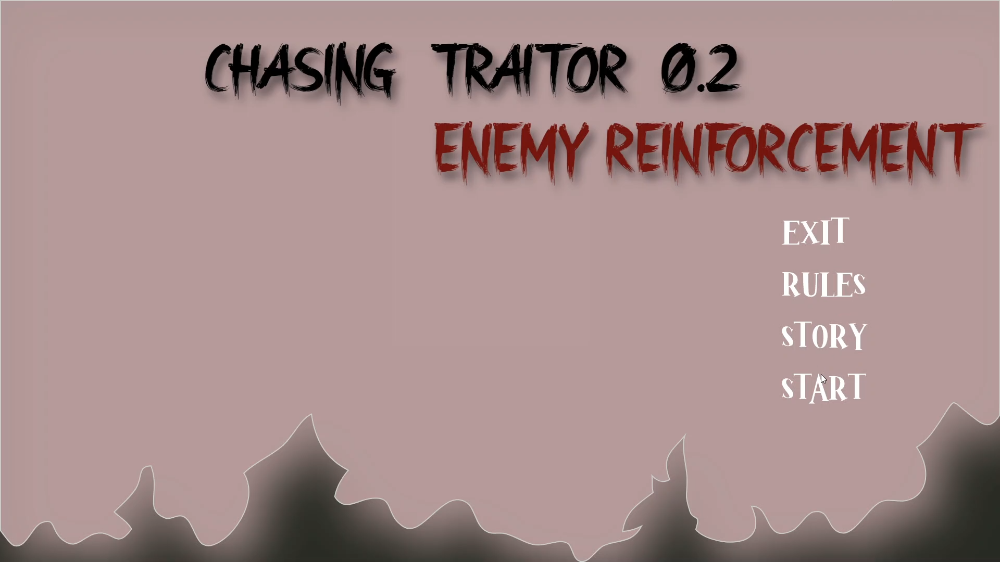
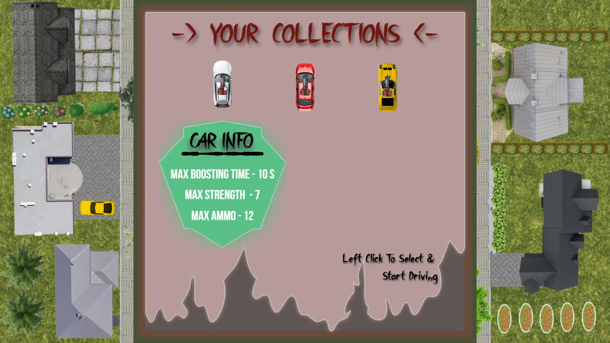
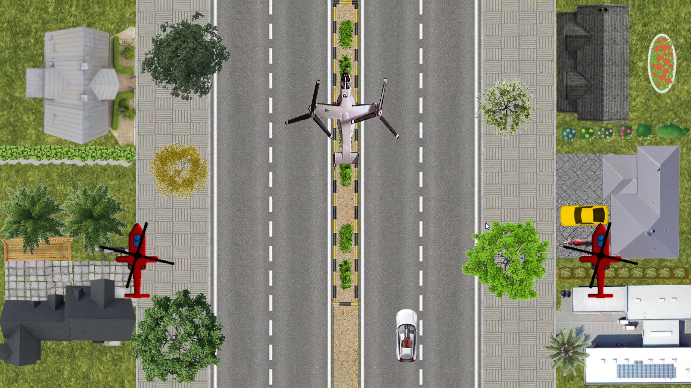
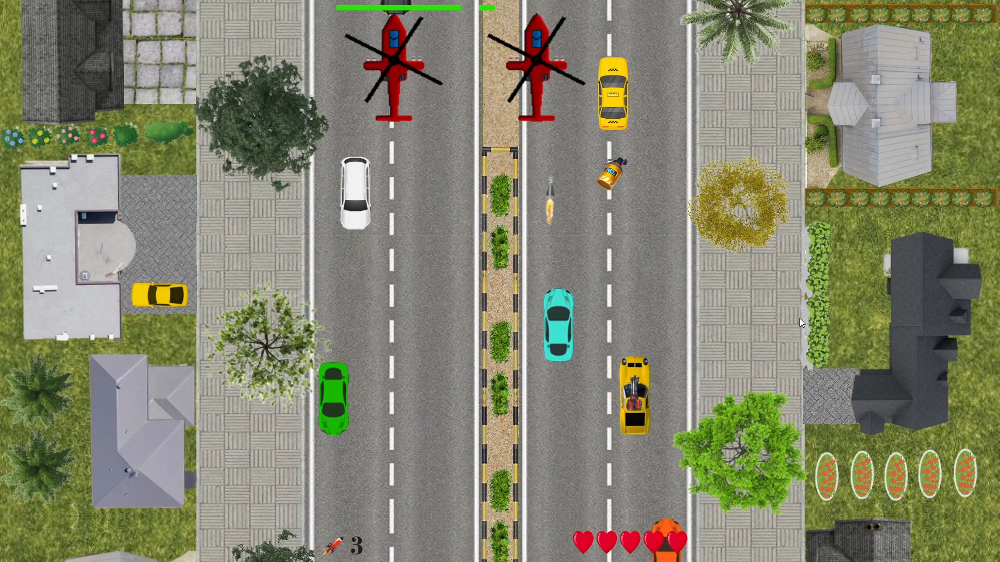
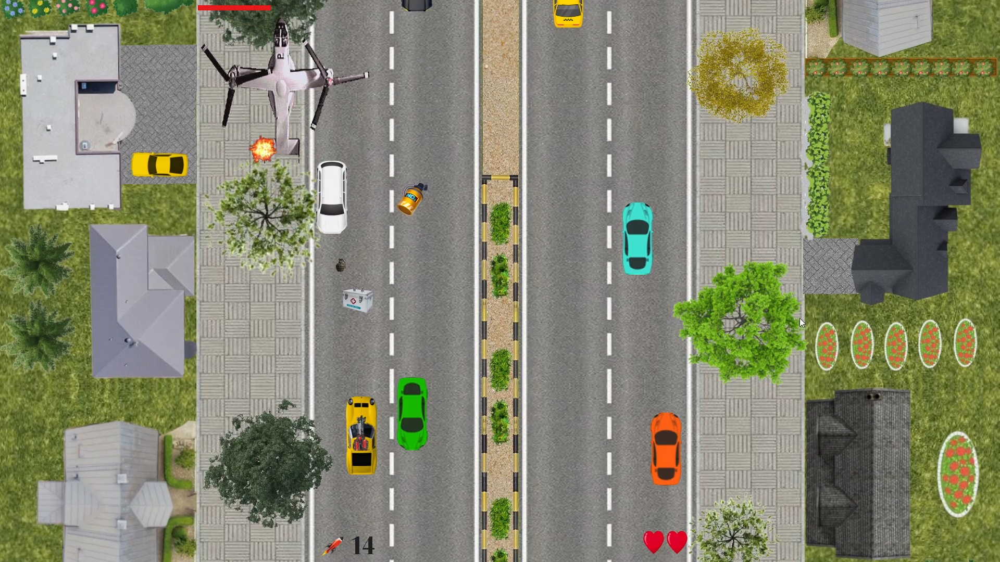

# Chasing Traitor 0.2 Enemy Reinforcement
A high-action game where you chase subordinates and a boss, collect missiles and boosters strive for victory!

### Gameplay Features
- Start with **5 LIVES** and **0 MISSILES**.
- Collect missiles to take down enemies.
- Use boosters to increase firing capacity to two missiles at once.
- Dodge enemy attacks and avoid collisions to survive.
- Pause, Resume or Restart the game anytime.

### Menu 
The **Menu** provides access to game options like rules, story, start, and exit.

### Car Selection
After clicking on the **START** button, you will see your car collection along with car details. The chase begins once you select a car.

### Chase Begins
Chase down the subordinates and the boss.

### Chasing Subordinates
Subordinates will try to avoid your attacks. Be careful about collisions and aim your missiles accurately.

### Boss Fight
Face the boss, who can throw grenades at you. A challenging finale awaits!

### Tools & Technology
This game was developed using:
- **[SFML](https://www.sfml-dev.org/)** for graphics and multimedia functionalities.
- **C++** as the core programming language.

### Acknowledgments
Special thanks to my teammates and friends who supported me during the development phase. I am grateful for their help!